  

  <strong>ENGENHARIA DE IA &nbsp; / &nbsp; WEB &nbsp; / &nbsp; MOBILE</strong> 
  Sorocaba, SP, Brasil &nbsp; · &nbsp; <a href="https://github.com/infortronicsltda">@infortronicsltda</a>

  <a href="#sobre-mim">Sobre mim</a> &nbsp; · &nbsp;
  <a href="#minha-stack">Minha stack</a> &nbsp; · &nbsp;
  <a href="#onde-trabalho">Onde trabalho</a> &nbsp; · &nbsp;
  <a href="./PERFIL-ESTATICO.md">Versão sem animações</a>

## Sobre mim

Sou **Luan Rodrigues**, engenheiro de IA e desenvolvedor full-stack na **Infortronics**. Trabalho com inteligência artificial e desenvolvimento de software para web e mobile.

Meu trabalho passa pelo backend em **C#/.NET**, pelas interfaces em **JavaScript, HTML e CSS** e pelo banco de dados **SQL Server**. No mobile, uso **Flutter com Dart**. **Java** também faz parte dos meus conhecimentos.

  

## Minha stack

| Área | Tecnologias e atuação |
| :--- | :--- |
| **Inteligência artificial** | Engenharia de IA aplicada ao desenvolvimento de soluções |
| **Backend** | `C#` · `.NET` |
| **Web** | `JavaScript` · `HTML` · `CSS` |
| **Mobile** | `Flutter` · `Dart` |
| **Banco de dados** | `SQL Server` |
| **Outros conhecimentos** | `Java` |

## Onde trabalho

Faço parte da **[Infortronics](https://github.com/infortronicsltda)**, em Sorocaba, SP.

Boa parte da minha atividade no GitHub acontece em repositórios privados. Por isso, os projetos públicos deste perfil representam apenas uma parte do meu trabalho.

  <a href="https://github.com/infortronicsltda"><strong>Conheça a Infortronics ↗</strong></a>

---

Luan Rodrigues · Engenharia de IA e desenvolvimento full-stack

